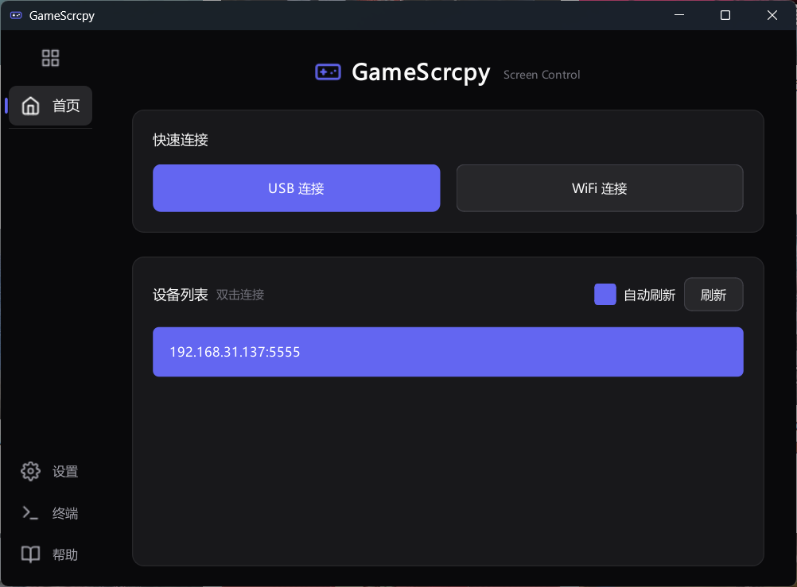
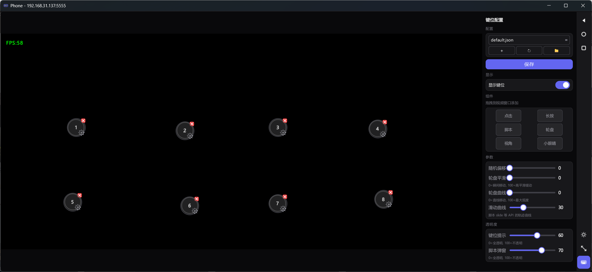
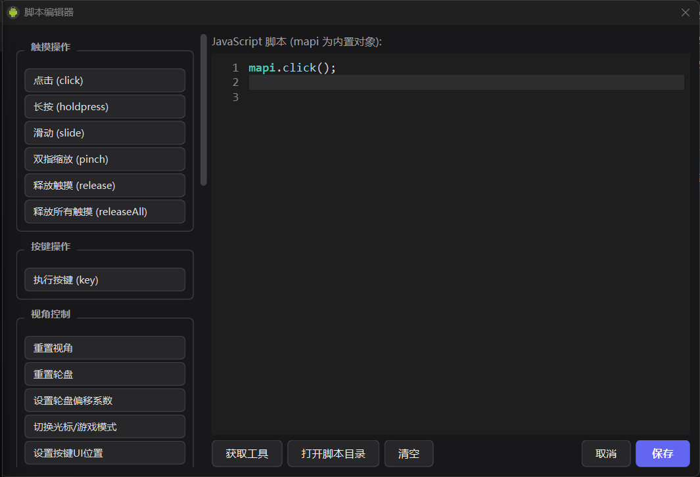
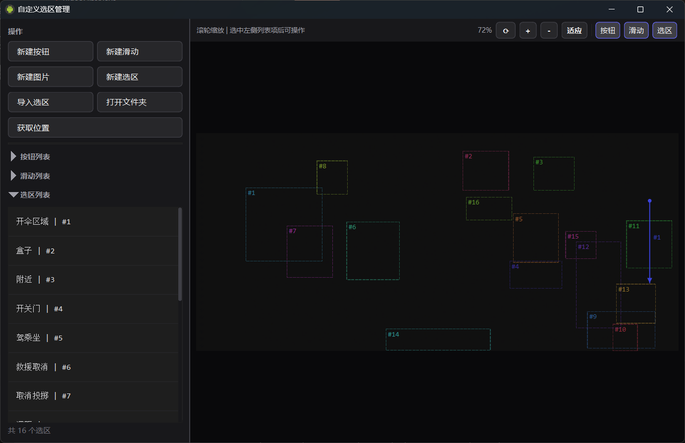

# GameScrcpy

**[English](README_EN.md)** | 中文

<h3 align="center">🎮 功能强大的 Android 设备投屏控制工具</h3>

<p align="center">
  <a href="../../releases"></a>
  
  
  
  <a href="LICENSE"></a>
  
</p>

<p align="center">
  <a href="#-核心特性">核心特性</a> •
  <a href="#-快速开始">快速开始</a> •
  <a href="#️-键位映射">键位映射</a> •
  <a href="#-脚本系统">脚本系统</a> •
  <a href="#-从源码构建">构建</a>
</p>

---
  交流群：762961615

---

<p align="center">
  
</p>

<p align="center">
  
</p>

<p align="center">
  
</p>

<p align="center">
  
</p>

---

## ⭐ 核心特性

### 🖥️ 高清投屏

- **高清低延迟** — H.264/H.265 硬件解码，延迟 < 50ms
- **USB / WiFi** — 支持有线和无线两种连接方式
- **双传输模式** — KCP 可靠传输 + 裸 UDP 极低延迟传输，WiFi 场景自动选择
- **FEC 前向纠错** — XOR 10:1 冗余编码，组内丢 1 包可恢复，弱网环境更稳定
- **自适应码率** — 编码器级 ABR + 网络层反馈双层控制，自动调整视频码率
- **服务端 GPU 滤镜** — OpenGL 仿射变换（旋转/裁剪/缩放），服务端完成画面变换
- **音频串流** — OPUS 音频实时转发 + WASAPI 低延迟播放
- **帧率可调** — 0-999 FPS 自由设置，0 = 不限制
- **性能监控** — 实时 FPS、解码延迟、网络延迟、CPU/内存指标
---

### 🎮 游戏键位映射

- **可视化编辑** — 拖拽式键位映射编辑器，所见即所得
- **多种映射类型** — 点击、方向轮盘、视角控制、自由视角
- **键位覆盖层** — 实时半透明显示当前键位映射状态，支持脚本动态移动/隐藏
- **组合键支持** — `Shift+G`、`Ctrl+A`、`Alt+Tab` 等
- **配置热加载** — 修改 JSON 配置后无需重启

| 映射类型 | 说明 | 适用场景 |
|:---------|:-----|:---------|
| `click` | 单击 | 技能、菜单 |
| `steerWheel` | 方向轮盘 | WASD 移动 |
| `drag` | 拖拽 | 技能方向 |
| `freeLook` | 自由视角 | FPS 小眼睛 |
| `script` | 脚本 | 自定义逻辑 |

---

### 🤖 脚本系统

- **JavaScript 引擎** — 基于 QuickJS 的沙箱化脚本系统
- **28 个 API** — 触摸、按键、滑动、缩放、延时、图像识别、虚拟按钮、预定义滑动、全局状态等
- **脚本编辑器** — 内置编辑器 + 快捷指令面板 + 代码片段插入 + 自动补全
- **获取工具** — 选区编辑器支持获取位置、新建按钮、新建滑动、截取图片、创建选区，右键生成代码
- **多脚本并行** — 独立沙箱、独立线程、互不干扰
- **自动启动** — 脚本可在投屏开始时自动运行（`// @autoStart`）
- **悬浮提示** — `toast()` 在画面上显示实时状态，支持拖拽移动

```javascript
// 示例：自动连点
while (!mapi.isInterrupted()) {
    mapi.click(0.5, 0.5);
    mapi.sleep(100);
}
```

---

### 📷 图像识别

- **OpenCV 模板匹配** — 精准找图定位
- **区域限定** — 坐标区域或自定义选区编号，提高效率
- **选区编辑器** — 可视化创建/编辑搜索区域，自动生成代码
- **模板截取** — 直接在预览画面上截取保存模板图片
- **置信度控制** — 自定义匹配精度阈值

```javascript
// 按坐标区域找图
var result = mapi.findImage("button", 0.7, 0.5, 1.0, 1.0, 0.8);
if (result.found) {
    mapi.click(result.x, result.y);
}

// 按选区编号找图（选区在编辑器中创建）
var result = mapi.findImageByRegion("button", 3, 0.8);
```

---

### 🎮 虚拟按钮与滑动路径

- **虚拟按钮** — 在选区编辑器中可视化创建屏幕位置标记，保存到 `buttons.json`
- **滑动路径** — 两次点击设置起点→终点，保存到 `swipes.json`
- **脚本集成** — `mapi.getbuttonpos(id)` 获取位置，`mapi.swipeById(id)` 执行滑动
- **右键生成代码** — 直接插入 `mapi.click()`/`mapi.slide()` 等代码到脚本编辑器

```javascript
// 获取虚拟按钮位置并点击
var btn = mapi.getbuttonpos(1);
if (btn.valid) mapi.click(btn.x, btn.y);

// 执行预定义滑动
mapi.swipeById(1, 200, 10);
```

---

### 🛡️ 拟人化操作

- **触摸随机偏移** — 每次点击/滑动自动添加随机偏移，避免坐标完全一致
- **滑动轨迹曲线** — 三层正弦叠加模拟真人滑动轨迹（主曲线 + 次曲线 + 微振动）
- **方向轮盘平滑** — 移动输入自然过渡
- **可调强度** — UI 滑块实时调节偏移量和曲线幅度 (0~100)

---

## 📥 快速开始

### 系统要求

| 项目 | 要求 |
|:-----|:-----|
| **操作系统** | Windows 10 / 11 (64位) |
| **Android 设备** | Android 5.0+ (API 21+) |
| **连接方式** | USB 数据线 或 WiFi 同一局域网 |

### 下载安装

从 [Releases](../../releases) 页面下载最新版本，解压后直接运行 `GameScrcpy.exe`。

### 使用步骤

1. **启用 USB 调试**
   ```
   设置 → 关于手机 → 连续点击"版本号" 7 次
   设置 → 开发者选项 → 启用 USB 调试
   ```

2. **连接设备** — USB 数据线连接，或输入设备 IP 进行 WiFi 连接

3. **开始投屏** — 点击「刷新设备」→ 选择设备 → 点击「开始投屏」


---

## 🤖 脚本 API

通过 `mapi` 对象调用，完整文档见 **[脚本 API 文档](docs/SCRIPT_API.md)**。

### 常用 API 速览

```javascript
// 触摸操作
mapi.click(x, y)              // 点击
mapi.holdpress(x, y)          // 按住（松开宏键自动释放）
mapi.releaseAll()              // 释放所有触摸点
mapi.slide(x1, y1, x2, y2, duration, steps)  // 滑动
mapi.pinch(cx, cy, scale, duration, steps)    // 双指缩放

// 控制流
mapi.sleep(ms)                // 延时
mapi.isInterrupted()          // 检查是否中断
mapi.isPress()                // 当前宏键是否按下

// 按键与工具
mapi.key("T", 50)             // 模拟键位按键
mapi.toast("消息", 3000)      // 悬浮提示
mapi.getKeyState("W")         // 获取按键状态 (1/0)
mapi.setKeyUIPos("J", x, y)   // 动态设置按键 UI 位置

// 全局状态（跨脚本共享）
mapi.setGlobal("key", value)
mapi.getGlobal("key")

// 游戏控制
mapi.shotmode(true)           // 切换射击/光标模式
mapi.resetview()              // 重置视角
mapi.resetwheel()             // 重置方向轮盘
mapi.setRadialParam(up, down, left, right)  // 设置移动速度

// 图像识别
mapi.findImage("name", x1, y1, x2, y2, threshold)
mapi.findImageByRegion("name", regionId, threshold)

// 虚拟按钮与滑动
mapi.getbuttonpos(buttonId)        // 获取虚拟按钮位置
mapi.swipeById(swipeId, ms, steps) // 按编号执行滑动

// 模块
mapi.loadModule("utils.js")   // 加载 ES6 模块
```

---

## 🏗️ 技术架构

```
GameScrcpy/
├── client/                 # 客户端 (Qt/C++)
│   ├── src/
│   │   ├── app/           # 应用入口、配置、首次运行协议
│   │   ├── ui/            # 用户界面、键位覆盖层、脚本编辑器、选区编辑器、性能监控
│   │   ├── control/       # 控制、键位映射、脚本引擎 (沙箱化)、责任链输入处理
│   │   ├── transport/     # 传输 (TCP / KCP / 裸 UDP / ADB)、FEC 前向纠错
│   │   ├── decoder/       # FFmpeg 视频解码 (零拷贝 SIMD + D3D11VA GPU 直通)
│   │   ├── render/        # D3D11 原生渲染 (零拷贝帧提交)
│   │   ├── core/          # 核心架构 (接口层/基础设施/实现/服务)
│   │   └── common/        # 配置中心、无锁性能监控、图像识别
│   └── env/               # 预编译依赖 (FFmpeg, ADB, OpenCV)
│
├── server/                 # 服务端 (Android/Java)
│   └── src/main/
│       ├── control/       # FastTouch O(1) 多点触控、v2 极简协议
│       ├── video/         # 编码 (ABR 自适应码率)、OpenGL 滤镜管线
│       ├── kcp/           # KCP 纯 Java 实现、裸 UDP 发送器、FEC 编码器
│       ├── session/       # 会话架构 (TCP/KCP 模板方法模式)
│       └── opengl/        # AffineOpenGLFilter GPU 仿射变换
│
├── keymap/                 # 键位配置文件
│   ├── images/            # 模板图片
│   ├── scripts/           # 脚本模块
│   └── regions.json       # 自定义选区
└── config/                 # 全局配置
```

### 核心依赖

| 组件 | 说明 |
|:-----|:-----|
| Qt 6.x (MSVC 2022) | GUI 框架 |
| FFmpeg 7.1 | 视频解码 |
| QuickJS | JavaScript 脚本引擎 |
| OpenCV 4.12 | 图像识别 (可选) |
| KCP | 低延迟 UDP 传输 |

---

## 🔧 从源码构建

详细构建指南见 **[BUILD.md](docs/BUILD.md)**。

### 一键脚本 (推荐)

```powershell
cd ci\win
.\build_all.bat --qt "C:\Qt\6.5.0"
```

### Qt Creator

1. 安装 Qt 6.5+ (MSVC 2022 64-bit)
2. 用 Qt Creator 打开 `client/CMakeLists.txt`
3. 选择 Release 配置，点击构建

### 服务端构建 (可选)

> 已内置预编译服务端，通常无需自行构建

```powershell
cd server
..\gradlew.bat assembleRelease
```

---

## 📄 许可证

[Apache License 2.0](LICENSE)

---

## 🙏 致谢

- [scrcpy](https://github.com/Genymobile/scrcpy) — Android 投屏先驱
- [QtScrcpy](https://github.com/barry-ran/QtScrcpy) — 项目基础
- [opencv_matching](https://github.com/acai66/opencv_matching) — OpenCV 图像匹配封装
- [QuickJS](https://bellard.org/quickjs/) — 嵌入式 JavaScript 引擎
- [FFmpeg](https://ffmpeg.org/) / [Qt](https://www.qt.io/) / [OpenCV](https://opencv.org/) / [KCP](https://github.com/skywind3000/kcp)

---

<p align="center">
  如果这个项目对你有帮助，欢迎给一个 ⭐ Star！
</p>
