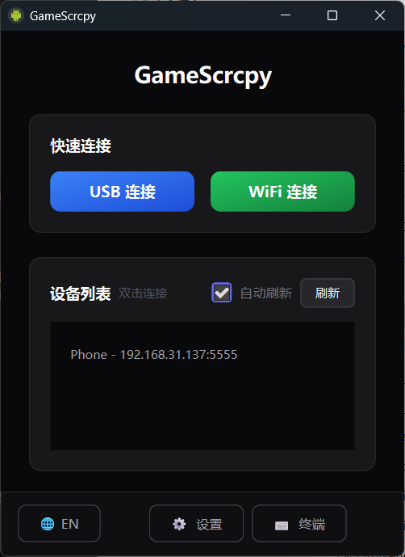
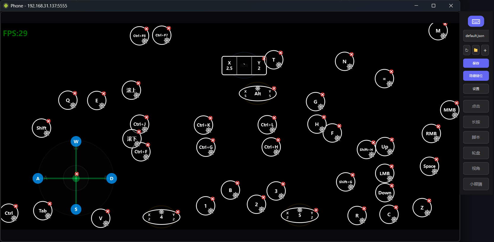
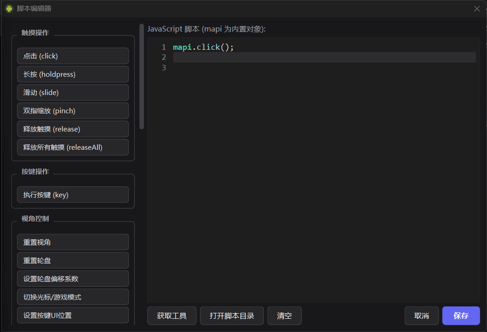
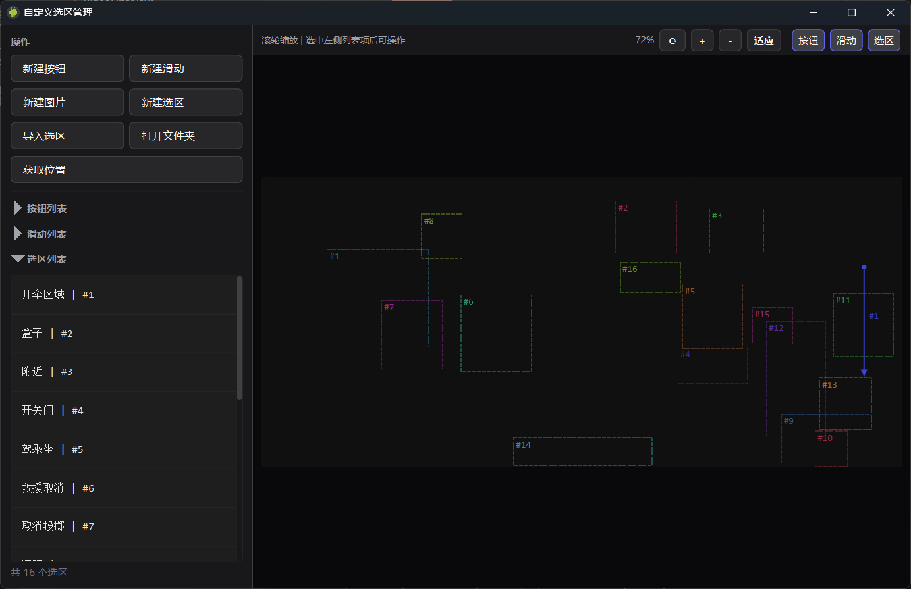

# GameScrcpy

[中文](README.md) | **English**

<h3 align="center">🎮 Powerful Android Screen Mirroring & Control Tool</h3>

<p align="center">
  <a href="../../releases"></a>
  
  
  
  <a href="LICENSE"></a>
  
</p>

<p align="center">
  <a href="#-key-features">Key Features</a> •
  <a href="#-quick-start">Quick Start</a> •
  <a href="#️-key-mapping">Key Mapping</a> •
  <a href="#-scripting-system">Scripting</a> •
  <a href="#-build-from-source">Build</a>
</p>

---

<p align="center">
  
</p>

<p align="center">
  
</p>

<p align="center">
  
</p>

<p align="center">
  
</p>

---

## ⭐ Key Features

### 🖥️ HD Screen Mirroring

- **HD & Low Latency** — H.264 hardware decoding, latency < 50ms
- **USB / WiFi** — Both wired and wireless connections supported
- **Dual Transport Mode** — KCP reliable transport + raw UDP ultra-low latency transport, auto-selected for WiFi
- **FEC Forward Error Correction** — XOR 10:1 redundancy encoding, recovers 1 lost packet per group for better stability on weak networks
- **Adaptive Bitrate** — Encoder-level ABR + network-layer feedback dual control, auto-adjusts video bitrate
- **Server-side GPU Filter** — OpenGL affine transform (rotate/crop/scale), video processing done on server
- **Adjustable FPS** — 0-999 FPS freely configurable, 0 = unlimited
- **Performance Monitor** — Real-time FPS, decode latency, network latency, CPU/memory metrics

---

### 🎮 Game Key Mapping

- **Visual Editor** — Drag-and-drop key mapping editor, WYSIWYG
- **Multiple Mapping Types** — Click, steer wheel, viewport control, free look
- **Key Overlay** — Real-time semi-transparent display of current key mapping state, supports script-driven movement/hiding
- **Combo Keys** — `Shift+G`, `Ctrl+A`, `Alt+Tab`, etc.
- **Hot Reload** — No restart needed after modifying JSON config

| Mapping Type | Description | Use Case |
|:-------------|:------------|:---------|
| `click` | Single click | Skills, menus |
| `steerWheel` | Steer wheel | WASD movement |
| `drag` | Drag | Skill direction |
| `freeLook` | Free look | FPS eye button |
| `script` | Script | Custom logic |

---

### 🤖 Scripting System

- **JavaScript Engine** — Sandboxed scripting system based on QJSEngine
- **28 APIs** — Touch, key press, swipe, pinch, delay, image recognition, virtual buttons, predefined swipes, global state, etc.
- **Script Editor** — Built-in editor + quick command panel + code snippet insertion + auto-complete
- **Tools** — Selection Editor supports get position, new button, new swipe, capture image, create region, with right-click code generation
- **Parallel Scripts** — Independent sandbox, independent thread, no interference
- **Auto Start** — Scripts can run automatically when mirroring starts (`// @autoStart`)
- **Floating Toast** — `toast()` displays real-time status on screen, supports drag to move

```javascript
// Example: Auto clicker
while (!mapi.isInterrupted()) {
    mapi.click(0.5, 0.5);
    mapi.sleep(100);
}
```

---

### 📷 Image Recognition

- **OpenCV Template Matching** — Precise image-based positioning
- **Region Constraints** — Coordinate regions or custom selection IDs for better performance
- **Selection Editor** — Visual creation/editing of search regions with auto code generation
- **Template Capture** — Capture and save template images directly from the preview
- **Confidence Control** — Customizable matching precision threshold

```javascript
// Find image by coordinate region
var result = mapi.findImage("button", 0.7, 0.5, 1.0, 1.0, 0.8);
if (result.found) {
    mapi.click(result.x, result.y);
}

// Find image by selection region ID (created in editor)
var result = mapi.findImageByRegion("button", 3, 0.8);
```

---

### 🎮 Virtual Buttons & Swipe Paths

- **Virtual Buttons** — Visually create screen position markers in the Selection Editor, saved to `buttons.json`
- **Swipe Paths** — Two clicks to set start→end points, saved to `swipes.json`
- **Script Integration** — `mapi.getbuttonpos(id)` to get position, `mapi.swipeById(id)` to execute swipe
- **Right-click Code Gen** — Directly insert `mapi.click()`/`mapi.slide()` code into the script editor

```javascript
// Get virtual button position and click
var btn = mapi.getbuttonpos(1);
if (btn.valid) mapi.click(btn.x, btn.y);

// Execute predefined swipe
mapi.swipeById(1, 200, 10);
```

---

### 🛡️ Human-like Input

- **Touch Random Offset** — Automatic random offset on each click/swipe to avoid identical coordinates
- **Swipe Trajectory Curve** — Triple sine wave overlay simulating human swipe paths (main + secondary + micro-vibration)
- **Steer Wheel Smoothing** — Natural transition for movement input
- **Adjustable Intensity** — UI slider for real-time offset and curve amplitude adjustment (0~100)

---

## 📥 Quick Start

### System Requirements

| Item | Requirement |
|:-----|:------------|
| **OS** | Windows 10 / 11 (64-bit) |
| **Android Device** | Android 5.0+ (API 21+) |
| **Connection** | USB cable or WiFi on the same network |

### Download & Install

Download the latest release from [Releases](../../releases), extract and run `GameScrcpy.exe`.

### Usage Steps

1. **Enable USB Debugging**
   ```
   Settings → About Phone → Tap "Build Number" 7 times
   Settings → Developer Options → Enable USB Debugging
   ```

2. **Connect Device** — USB cable, or enter device IP for WiFi connection

3. **Start Mirroring** — Click "Refresh Devices" → Select device → Click "Start Mirroring"


---

## 🤖 Script API

All APIs are called via the `mapi` object. Full documentation: **[Script API Reference](docs/SCRIPT_API_EN.md)**.

### Common API Quick Reference

```javascript
// Touch operations
mapi.click(x, y)              // Click
mapi.holdpress(x, y)          // Hold press (auto-release on key up)
mapi.releaseAll()              // Release all touch points
mapi.slide(x1, y1, x2, y2, duration, steps)  // Swipe
mapi.pinch(cx, cy, scale, duration, steps)    // Pinch zoom

// Control flow
mapi.sleep(ms)                // Delay
mapi.isInterrupted()          // Check interruption
mapi.isPress()                // Is macro key currently pressed

// Keys & utilities
mapi.key("T", 50)             // Simulate mapped key press
mapi.toast("message", 3000)   // Floating toast
mapi.getKeyState("W")         // Get key state (1/0)
mapi.setKeyUIPos("J", x, y)   // Dynamically set key UI position

// Global state (shared across scripts)
mapi.setGlobal("key", value)
mapi.getGlobal("key")

// Game control
mapi.shotmode(true)           // Toggle shoot/cursor mode
mapi.resetview()              // Reset viewport
mapi.resetwheel()             // Reset steer wheel
mapi.setRadialParam(up, down, left, right)  // Set movement speed

// Image recognition
mapi.findImage("name", x1, y1, x2, y2, threshold)
mapi.findImageByRegion("name", regionId, threshold)

// Virtual buttons & swipes
mapi.getbuttonpos(buttonId)        // Get virtual button position
mapi.swipeById(swipeId, ms, steps) // Execute swipe by ID

// Modules
mapi.loadModule("utils.js")   // Load ES6 module
```

---

## 🏗️ Architecture

```
GameScrcpy/
├── client/                 # Client (Qt/C++)
│   ├── src/
│   │   ├── app/           # Application entry, configuration, first-run agreement
│   │   ├── ui/            # User interface, key overlay, script editor, selection editor, perf monitor
│   │   ├── control/       # Control, key mapping, script engine (sandboxed), chain-of-responsibility input
│   │   ├── transport/     # Transport (TCP / KCP / raw UDP / ADB), FEC forward error correction
│   │   ├── decoder/       # FFmpeg video decoding (zero-copy SIMD + D3D11VA GPU passthrough)
│   │   ├── render/        # OpenGL rendering (PBO async DMA + D3D11-GL interop)
│   │   ├── core/          # Core architecture (interfaces/infra/impl/service)
│   │   └── common/        # Config center, lock-free perf monitor, image matching
│   └── env/               # Prebuilt dependencies (FFmpeg, ADB, OpenCV)
│
├── server/                 # Server (Android/Java)
│   └── src/main/
│       ├── control/       # FastTouch O(1) multi-touch, v2 minimal protocol
│       ├── video/         # Encoding (ABR adaptive bitrate), OpenGL filter pipeline
│       ├── kcp/           # KCP pure Java impl, raw UDP sender, FEC encoder
│       ├── session/       # Session architecture (TCP/KCP template method pattern)
│       └── opengl/        # AffineOpenGLFilter GPU affine transform
│
├── keymap/                 # Key mapping config files
│   ├── images/            # Template images
│   ├── scripts/           # Script modules
│   └── regions.json       # Custom selection regions
└── config/                 # Global configuration
```

### Core Dependencies

| Component | Description |
|:----------|:------------|
| Qt 6.x (MSVC 2022) | GUI framework, multimedia |
| FFmpeg 7.1 | Video decoding |
| OpenCV 4.12 | Image recognition (optional) |
| KCP | Low-latency UDP transport |

---

## 🔧 Build from Source

See the detailed build guide: **[BUILD.md](docs/BUILD_EN.md)**.

### One-Click Script (Recommended)

```powershell
cd ci\win
.\build_all.bat --qt "C:\Qt\6.5.0"
```

### Qt Creator

1. Install Qt 6.5+ (MSVC 2022 64-bit)
2. Open `client/CMakeLists.txt` in Qt Creator
3. Select Release configuration, click Build

### Server Build (Optional)

> A prebuilt server is included; you typically don't need to build it yourself.

```powershell
cd server
..\gradlew.bat assembleRelease
```

---

## 📄 License

[Apache License 2.0](LICENSE)

---

## 🙏 Acknowledgments

- [scrcpy](https://github.com/Genymobile/scrcpy) — Android screen mirroring pioneer
- [QtScrcpy](https://github.com/barry-ran/QtScrcpy) — Project foundation
- [opencv_matching](https://github.com/acai66/opencv_matching) — OpenCV image matching wrapper
- [FFmpeg](https://ffmpeg.org/) / [Qt](https://www.qt.io/) / [OpenCV](https://opencv.org/) / [KCP](https://github.com/skywind3000/kcp)

---

<p align="center">
  If you find this project helpful, please give it a ⭐ Star!
</p>
